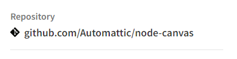
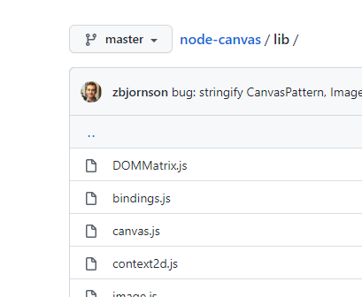

# How to Load external Javscript libraries into MLE
This page is an experiment to leverage the MLE engine in Oracle 21c to do server side image thumbnail creation in APEX 21c.

- This article is a great baseline [APEX MLE](https://medium.com/graalvm/javascript-as-a-server-side-language-in-oracle-apex-20-2-457e073ca4ca)

## Locating the modules that you need to Load

- In this example we want to load the canvas npm libraries so we went to [https://www.npmjs.com/package/canvas](https://www.npmjs.com/package/canvas)

- From the corner of the NPM page navigate to the github repo.


- Look inside the git repo in the lib directory to the core js files required.


## Load Javascript into ATP

- Create a table structure to store the js as a clob

```
CREATE TABLE  "MLE_MODULE"
   (	"ID" NUMBER GENERATED BY DEFAULT ON NULL AS IDENTITY MINVALUE 1 MAXVALUE 9999999999999999999999999999 INCREMENT BY 1 START WITH 1 CACHE 20 NOORDER  NOCYCLE  NOKEEP  NOSCALE  NOT NULL ENABLE,
	"NAME" VARCHAR2(255 CHAR) COLLATE "USING_NLS_COMP",
	"LINK" VARCHAR2(4000 CHAR) COLLATE "USING_NLS_COMP",
	"CONTENT" CLOB COLLATE "USING_NLS_COMP",
	"CREATED" TIMESTAMP (6) WITH LOCAL TIME ZONE NOT NULL ENABLE,
	"CREATED_BY" VARCHAR2(255 CHAR) COLLATE "USING_NLS_COMP" NOT NULL ENABLE,
	"UPDATED" TIMESTAMP (6) WITH LOCAL TIME ZONE NOT NULL ENABLE,
	"UPDATED_BY" VARCHAR2(255 CHAR) COLLATE "USING_NLS_COMP" NOT NULL ENABLE,
	 CONSTRAINT "MLE_MODULE_ID_PK" PRIMARY KEY ("ID")
  USING INDEX  ENABLE,
	 CONSTRAINT "MLE_MODULE_NAME_UNQ" UNIQUE ("NAME")
  USING INDEX  ENABLE
   )  DEFAULT COLLATION "USING_NLS_COMP"
/

CREATE OR REPLACE EDITIONABLE TRIGGER  "MLE_MODULE_BIU"
    before insert or update  
    on mle_module
    for each row
begin
    if inserting then
        :new.created := localtimestamp;
        :new.created_by := coalesce(sys_context('APEX$SESSION','APP_USER'),user);
    end if;
    :new.updated := localtimestamp;
    :new.updated_by := coalesce(sys_context('APEX$SESSION','APP_USER'),user);
end mle_module_biu;

/
ALTER TRIGGER  "MLE_MODULE_BIU" ENABLE
/
```

- Load Libraries

```
declare
    type module_t is table of varchar2(100) index by varchar2(100);
    l_modules   module_t := module_t();
    l_module    varchar2(100);
    l_code      clob;
    --temp variables to test
    len INTEGER;

begin
    /* store the name and location of each library that is to be imported */
    l_modules('canvas')     := 'https://github.com/Automattic/node-canvas/blob/master/lib/canvas.js';
    l_modules('DOMMatrix')     := 'https://github.com/Automattic/node-canvas/blob/master/lib/DOMMatrix.js';
    l_modules('bindings')     := 'https://github.com/Automattic/node-canvas/blob/master/lib/bindings.js';
    l_modules('context2d')     := 'https://github.com/Automattic/node-canvas/blob/master/lib/context2d.js';
    l_modules('image')     := 'https://github.com/Automattic/node-canvas/blob/master/lib/image.js';
    l_modules('jpegstream')     := 'https://github.com/Automattic/node-canvas/blob/master/lib/jpegstream.js';
    l_modules('parse-font')     := 'https://github.com/Automattic/node-canvas/blob/master/lib/parse-font.js';
    l_modules('pattern')     := 'https://github.com/Automattic/node-canvas/blob/master/lib/pattern.js';
    l_modules('pdfstream')     := 'https://github.com/Automattic/node-canvas/blob/master/lib/pdfstream.js';
    l_modules('pngstream')     := 'https://github.com/Automattic/node-canvas/blob/master/lib/pngstream.js';


    l_module := l_modules.first;

    /* loop through all records, GET each library and save it in the javascript_modules table */
    while l_module is not null
    loop
        l_code := apex_web_service.make_rest_request( p_url => l_modules(l_module), p_http_method => 'GET');
        dbms_output.put_line(DBMS_LOB.GETLENGTH(l_code));        
        l_module := l_modules.next(l_module);
    end loop;

    commit;
end;
/
```
